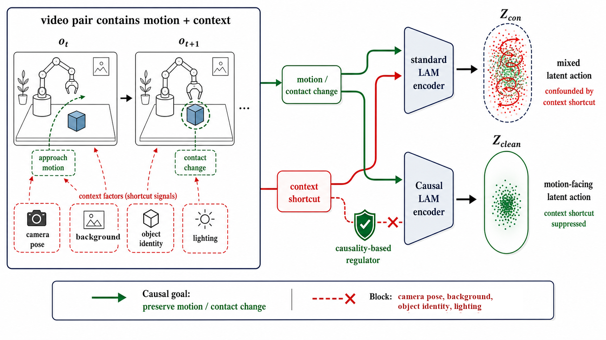
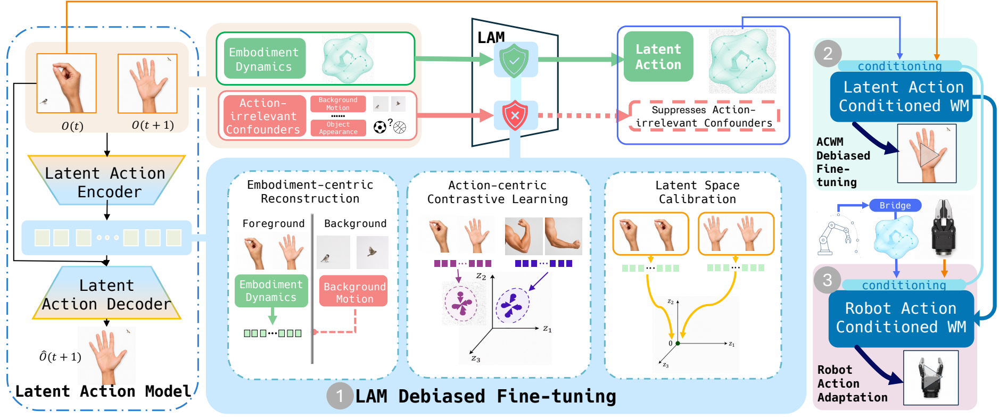

<div align="center">
  <h1>CD-LAM</h1>
  <p><strong>Causally Debiased Latent Action Model for Embodied Action Conditioned World Models</strong></p>
  <p>
    <a href="https://github.com/yufanwei/CD-LAM/actions/workflows/ci.yml"></a>
    <a href="https://www.python.org/"></a>
    <a href="LICENSE"></a>
    <a href="https://huggingface.co/yufanwei/CD-LAM"></a>
  </p>
  <p>
    <a href="https://github.com/yufanwei/CD-LAM">Code</a> ·
    <a href="https://yufanwei.github.io/CD-LAM-project-page/">Project page</a> ·
    <a href="https://huggingface.co/yufanwei/CD-LAM">Models</a>
  </p>
</div>

<p align="center">
  
</p>

CD-LAM reduces action-irrelevant bias before latent actions condition a world
model. It debiases the latent action model, adapts the action-conditioned world
model in the repaired latent space, and finally aligns executable robot actions
to that same space.

## Start here

| goal | entry point |
|---|---|
| Validate a fresh clone | [Quick start](#quick-start) |
| Prepare AgiBotWorld or EgoDex | [Real datasets](#download-and-prepare-real-datasets) |
| Train Stage 1, Stage 2, bridge, or Stage 3 | [Training commands](#training-commands) |
| Understand bridge vs. no-bridge paths | [When to use the bridge](#when-to-use-the-bridge) |
| Change a compatible 2B checkpoint or port another backbone | [Backbone boundary](#switching-model-backbones) |
| Build the isolated 2B CUDA environment | [Model runtime setup](#environments-and-external-dependencies) |
| Score protocol-compatible foreground tracks | [Evaluation](docs/EVALUATION.md) |

## Highlights

On the manuscript's AgiBot robot-action rollout protocol, CD-LAM reports mean
FDCE **8.24** versus 12.63 and PSNR **20.60 dB** versus 19.85 dB at 2B; at
14B it reports mean FDCE **7.73** versus 11.11 and PSNR **21.01 dB** versus
20.01 dB. The manuscript also reports reaching the reference metric thresholds
with more than **12x fewer aligned robot-action adaptation updates**. These are
transcribed manuscript values, not results regenerated by this source release;
the release audit also found that the historical FDCE scorer used a different
reduction order from the manuscript equation. Canonical rescoring on frozen
populations is required before claiming code-level reproduction. The exact
tables and comparison qualification are in
[`docs/results/paper_results.json`](docs/results/paper_results.json).

> **Release status:** source setup, CPU integration, the pinned 2B runtime
> overlay, real stage launchers, AgiBot/EgoDex preparation, action-contract
> binding, and result validators are included. A compact Hugging Face snapshot
> with exactly three main 2B entries has passed local tensor, schema, and
> checksum validation, but publication at an immutable Hugging Face revision is
> still pending; the downloader deliberately rejects the current legacy
> `main`. Datasets, the NVIDIA base checkpoint, and 14B weights are not
> redistributed. The release tests execution and lineage; it does not claim
> that a source-only clone reproduces the manuscript tables.

## Quick start

Requirements: Linux or macOS, Bash, Git, and Python 3.10 or newer. The default
validation path is CPU-only and creates an isolated virtual environment.

```bash
git clone https://github.com/yufanwei/CD-LAM.git && cd CD-LAM && bash scripts/bootstrap.sh
```

For a machine without package-index access, create or transfer a hashed
platform cache and run the same gate with `--offline-cache`. See
[Offline and fresh-machine setup](docs/OFFLINE.md). Exposing packages from a
parent environment requires the explicit `--reuse-system-runtime` option and
does not count as clean-install evidence.

Run the complete source-release gate:

```bash
make check
```

Run a real backward/optimizer/checkpoint pass through the complete training
graph on synthetic data:

```bash
bash scripts/run.sh train-smoke --output-root outputs/train-smoke --steps 2
```

This command executes and chains:

```text
Stage 1 ─┬─> Stage 2 ─┐
         └─> Bridge ──┴─> Stage 3
```

It writes four loadable checkpoints, per-stage result metadata, upstream
SHA-256 lineage, and `run_summary.json`. The synthetic backend tests training
plumbing; it is not a small substitute for the paper models.

<p align="center">
  
</p>

Build and validate every staged data contract from the bundled test fixture:

```bash
bash scripts/run.sh data-prepare \
  --input tests/fixtures/episodes.jsonl \
  --output outputs/test-data
bash scripts/run.sh data-validate --root outputs/test-data
```

The fixture has episode-disjoint train/test metadata and aligned 22D actions.
It produces Stage-1 pairs, Stage-2 13-frame windows, raw stride-four bridge
pairs, and Stage-3 13-frame/12-transition windows.

## Download and prepare real datasets

CD-LAM does not redistribute dataset archives or processed samples. Always
download from the publisher and review the terms before using the data.

| dataset | official source | access | publisher license | practical starting point |
|---|---|---|---|---|
| AgiBotWorld Alpha | [project repository](https://github.com/OpenDriveLab/Agibot-World) and [official Hugging Face dataset](https://huggingface.co/datasets/agibot-world/AgiBotWorld-Alpha) | gated Hugging Face access | CC BY-NC-SA 4.0 plus the gated community agreement | `sample_dataset.tar`, about 7.1 GB; the publisher describes about 8.5 TB of Alpha data, while the HF repository footprint may be larger |
| EgoDex | [Apple repository](https://github.com/apple/ml-egodex), [Part 2 ZIP](https://ml-site.cdn-apple.com/datasets/egodex/part2.zip), and [native test ZIP](https://ml-site.cdn-apple.com/datasets/egodex/test.zip) | public Apple CDN | CC BY-NC-ND | 16 GB native test archive for format inspection; Part 2, about 300 GB, for a bounded adapter train/evaluation subset |

Dataset access may be online even when the model machine is configured for
offline checkpoint resolution. Dataset credentials are never read by the
training entry points. Install the optional download and conversion tools in
the repository environment, choose a writable local data root, and print the
exact publisher URLs without downloading anything:

```bash
.venv/bin/python -m pip install -e '.[data,download]'
export CDLAM_DATA_ROOT="${CDLAM_DATA_ROOT:-$PWD/data}"
mkdir -p "$CDLAM_DATA_ROOT/raw" "$CDLAM_DATA_ROOT/prepared"
.venv/bin/python scripts/download_datasets.py links
```

### AgiBotWorld Alpha

Open the official dataset page in a browser, accept its gated terms, and log
in with that same Hugging Face account. Then download and safely extract the
official sample:

```bash
.venv/bin/hf auth login
.venv/bin/python scripts/download_datasets.py agibot-sample \
  --output "$CDLAM_DATA_ROOT/raw/agibot-alpha" \
  --accept-license --extract
```

A `403` means that the authenticated account has not been approved for this
gated dataset; it is not a CD-LAM conversion error. The official download is
resolved at the release-pinned dataset commit, checked against the expected
7,097,989,120-byte archive SHA-256, and recorded in `agibot_download.json`
before extraction under `$CDLAM_DATA_ROOT/raw/agibot-alpha/sample_dataset/`. The full
action path expects the publisher's extracted episode layout with
`task_info/`, `observations/`, and `proprio_stats/`. It validates and slices
the same `[start_frame, end_frame)` interval across video, timestamps, state,
and all official action arrays. It never derives commands from robot state or
silently fills base velocity with zeros.

Prepare selected complete episodes, portable Stage-1/Stage-2 train/evaluation
indexes, a LeRobot tree, and an episode-disjoint bridge cache in one command:

```bash
.venv/bin/python -m pip install -e '.[data]'
bash scripts/run.sh prepare-agibot \
  --raw-root "$CDLAM_DATA_ROOT/raw/agibot-alpha/sample_dataset" \
  --output-root "$CDLAM_DATA_ROOT/prepared/agibot-alpha" \
  --max-episodes 32
```

The command is deterministic and episode-granular. Its final
`prepare_summary.json` gives the exact Stage-1 train/evaluation Parquet files,
Stage-2 train/evaluation manifests, LeRobot YAML, and bridge cache to place in
`configs/runtime.json`. If a bounded selection cannot produce nonempty splits,
it fails and asks for more complete physical episodes. If the selected archive
omits any required `action/*` dataset, it also fails instead of inventing
supervision. The exact official sparse-download procedure, schemas,
intermediate paths, and manual stage commands are in
[AgiBot raw conversion](docs/RAW_AGIBOT.md).

### EgoDex

The native test archive is useful only for inspecting the format. It remains
`split=test` and is excluded from CD-LAM train/evaluation bytes. Download Part
2 as well to build a real Stage-1/Stage-2 subset. Downloads resume, complete
ZIPs are checked before extraction, and each part receives its own extraction
directory so multiple archives can share one output root:

```bash
# Optional 16 GB format inspection.
.venv/bin/python scripts/download_datasets.py egodex \
  --part test --output "$CDLAM_DATA_ROOT/raw/egodex" \
  --accept-license --extract

# Bounded adapter train/evaluation source; roughly 300 GB.
.venv/bin/python scripts/download_datasets.py egodex \
  --part part2 --output "$CDLAM_DATA_ROOT/raw/egodex" \
  --accept-license --extract
```

The downloader keeps each verified ZIP beside its extracted directory so a
failed extraction can be retried. Budget space for both copies: approximately
the archive size plus the extracted size. That is more than 16 GB for `test`
and more than 300 GB for `part2`; the exact extracted size may be larger.
Remove an archive only after you have verified that extraction and recorded
its provenance.

Generate a deterministic clip index directly from the extracted Part 2 tree.
The indexer reads `session_name` from each HDF5 file and assigns every clip
from one physical session to the same split. Unknown task names remain
unlabeled unless an explicit task-to-primitive JSON mapping is supplied.

```bash
.venv/bin/python scripts/index_egodex.py \
  --root "$CDLAM_DATA_ROOT/raw/egodex/extracted/part2" \
  --part part2 \
  --output "$CDLAM_DATA_ROOT/prepared/egodex-part2-bounded.jsonl" \
  --eval-fraction 0.10 --seed 42 --max-clips 32

PYTHONPATH=internal/vendor/scale_support \
  .venv/bin/python internal/runtime/audit_raw_splits.py \
  --input "$CDLAM_DATA_ROOT/prepared/egodex-part2-bounded.jsonl"

.venv/bin/python internal/runtime/build_raw_subset.py \
  --input "$CDLAM_DATA_ROOT/prepared/egodex-part2-bounded.jsonl" \
  --output "$CDLAM_DATA_ROOT/prepared/cdlam-stage12-subset"
```

`--max-clips 32` deterministically chooses complete physical-session groups;
it never cuts one session across the bounded manifest and retains nonempty
train and evaluation splits. The indexer fails if media and metadata pairing
is ambiguous, if fewer than two non-test physical sessions cannot form both
splits, or if the requested bound cannot retain whole session groups. See
[EgoDex raw indexing](docs/RAW_EGODEX.md) for the optional primitive map,
native-test handling, output rows, and validation commands.

### What these paths do and do not build

| output | AgiBot path | EgoDex path |
|---|---:|---:|
| Stage-1/Stage-2 bounded adapter subset | yes, from materialized segments | yes |
| 22D action data, bridge cache, and Stage 3 | yes, when official action arrays are present | no |
| paper-compatible SAM3 masks | external or precomputed | external or precomputed |
| complete paper data mixture | no | no |

Processing only AgiBot and EgoDex is a valid subset experiment and cleanroom
adapter test, not a paper-table reproduction. The complete schemas, split
rules, and minimum checks are in [Data preparation](docs/DATA.md) and
[Raw subset builder](docs/RAW_SUBSET.md).

## Download released models

The compact three-entry snapshot is locally upload-ready but has not yet
replaced the legacy Hugging Face `main`. Model download therefore fails before
network transfer unless an immutable compact-release commit is supplied. After
that commit is published, create the environment, pass every source gate,
download the snapshot, and verify every model hash with:

```bash
export CDLAM_HF_REVISION=<40-character-Hugging-Face-commit>
bash scripts/bootstrap.sh --with-models
```

The snapshot is written to the ignored `artifacts/` directory. To fetch only
one compatible lineage or component after normal bootstrap, install the
download extra and use a quoted Hugging Face allow pattern:

```bash
.venv/bin/python -m pip install -e '.[download]'
bash scripts/run.sh download-models \
  --revision "$CDLAM_HF_REVISION" \
  --allow-pattern 'models/posttrain-100h/*'
```

Every selective request automatically includes `asset_manifest.json`; the
command rejects the legacy layout, mutable official-repository revisions,
wrong model identities, missing files, size mismatches, and SHA-256 mismatches. The
LAM and pretrain entries are compatible with each other. `posttrain-100h`
belongs to a different 100h latent-space lineage and must use its colocated
bridge/contract; the three entries are not one direct chain. Model roles and
limitations are documented in [Release artifacts](docs/ARTIFACTS.md).

## Repository layout

```text
.github/       CI and contribution guide
configs/       2B/14B protocol templates and portable path examples
docs/          method docs, model card, examples, and paper-result fixtures
internal/      bounded raw-data adapters and their isolated support modules
scripts/       one-command setup, runtime entry point, and release utilities
src/           installable cd_lam package
tests/         unit/integration tests and the portable fixtures/ test-set folder
third_party/   pinned external references, patches, and license notes
```

Generated data, model weights, caches, and outputs stay outside the package
and are ignored by Git.

## Training commands

Real 2B training uses one JSON profile. Copy the checked-in example, fill only
local paths, and keep the populated file out of Git:

```bash
CDLAM_ACCEPT_BASE_LICENSE=yes bash scripts/bootstrap_model_runtime.sh
cp configs/runtime.example.json configs/runtime.json
# Fill the dataset/checkpoint paths; keep the generated model-environment paths
# unless you selected custom --environment or --deps-root locations.
bash scripts/run.sh runtime-doctor --stage all
```

Every path is resolved from the profile's `workspace`, so launch CWD does not
change the dataset or checkpoint. Print the exact subprocesses without using a
GPU:

```bash
bash scripts/run.sh pipeline --dry-run
```

Run one stage, or the complete lineage, only after the doctor passes:

```bash
bash scripts/run.sh stage1   --allow-gpu
bash scripts/run.sh bridge   --allow-gpu
bash scripts/run.sh stage2   --allow-gpu
bash scripts/run.sh stage3   --allow-gpu

# Or produce Stage 1, bridge, Stage 2, then Stage 3 in one routed run.
bash scripts/run.sh pipeline --allow-gpu
```

The pipeline feeds the newly produced Stage-1 checkpoint to both bridge and
Stage 2, atomically binds the new bridge to the action contract, and then feeds
the new Stage-2 checkpoint and bridge to Stage 3. Each stage repeats its own
preflight and post-run validation. Independent later-stage commands instead
require their configured released or user-supplied parent checkpoints.

The lightweight typed planner remains available for custom integrations and
for the deterministic CPU backend:

```bash
bash scripts/run.sh plan-stage1 \
  --config configs/pipeline_100h_2b.yaml --dry-run --json
.venv/bin/cdlam stage1 --config configs/pipeline_100h_2b.yaml \
  --synthetic --steps 2 --device cpu
```

See [Training runtime](docs/TRAINING.md) and
[Training correctness gates](docs/TRAINING_CORRECTNESS.md).

## When to use the bridge

The bridge is not a general preprocessing layer.

| path | condition entering the world model | bridge |
|---|---|---:|
| Stage 1 | no world-model condition | no |
| Stage 2 | 32D latent action from the fine-tuned LAM | no |
| Stage 3 | aligned 22D robot transition mapped to 32D | yes |
| robot-action rollout | the same 22D convention used by Stage 3 | yes |

Without a bridge, pass the LAM's 32D output directly to the latent-action
conditioning slot. Do not send a video-derived latent through the robot bridge.

With a bridge, the full checkpoint-specific transform is:

```text
u_norm = (u - action_mean) / action_std
z_hat  = g(u_norm) * zsd + zm
```

For the AgiBot Alpha configuration, `u` is a raw adjacent transition at a
four-source-frame cadence, ordered as arm 14 + grippers 2 + head 2 + waist 2 +
base 2. The reference loader first emits min-max-normalized cumulative deltas
inside four-token blocks. A compatible Stage-3 adapter must first-difference
each block and multiply by `(action_max - action_min) / 2` before invoking the
raw-action bridge. CD-LAM provides and tests this algebra in
`cd_lam.data.action`.

A valid bridge bundle includes all of:

```text
g_state, action_mean, action_std, zm, zsd, latent_dim
```

Validate a trusted file before use:

```bash
.venv/bin/cdlam validate-bridge /absolute/path/to/bridge.pt
```

Changing action order, units, coordinate frame, cadence, delta rule, or the
upstream LAM requires a matching bridge. Shape `(…, 22)` alone is not enough.

## Data contracts

Split every dataset by episode before extracting neighboring transitions.
Every prepared record must retain stable IDs, split, source reference, frame
indices or timestamps, FPS, crop/resize policy, and preprocessing identity.

| component | minimum semantic input |
|---|---|
| Stage 1 | ordered frame pair, foreground mask, coarse primitive label, identity-pair flag |
| Stage 2 | at least 13 frames, source FPS, exact Stage-1 LAM identity |
| bridge training | raw 22D adjacent action delta, aligned frame pair, episode split |
| Stage 3 | 13-frame robot window, 12 aligned transitions, Stage-2 and bridge identities |

Normalization statistics are computed on the training split only. A latent
cache or bridge becomes invalid when the LAM checkpoint or preprocessing
changes. Detailed schemas and golden checks are in [Data preparation](docs/DATA.md).

## Switching model backbones

The bundled real runtime is intentionally locked to the pinned 2B architecture.
To select another compatible 2B checkpoint, edit one local runtime profile and
change the base checkpoint plus all parent assets as a unit:

```bash
cp configs/runtime.example.json configs/runtime.json
# Edit paths.base_world_checkpoint, base_lam_checkpoint, and any independent
# stage1/bridge/stage2 checkpoints, then validate every stage.
bash scripts/run.sh runtime-doctor --stage all
```

The LAM must still expose a 32D latent, and the Stage-2 state, Stage-3
initialization, bridge, preprocessing, and action contract must share that
space. A filename or scale label is not a compatibility check.

`configs/pipeline_100h_14b.yaml` records the manuscript's 14B protocol for a
custom `cd_lam.adapters.StageAdapter`; the bundled real launcher does not claim
14B support and no 14B release weight is provided. Porting another architecture
requires an explicit adapter, trainable-scope audit, checkpoint loader, and
one-update acceptance run. It is not enabled by changing a single YAML field.

The paper budgets are 1,000 Stage-1 updates, 2,000 Stage-2 updates, and 3,000
(2B) or 6,000 (14B) Stage-3 updates. The audited historical 150-update LAM is
a partial artifact and is not presented as the paper's 1,000-update output.

## Environments and external dependencies

Use separate environments for dependency surfaces that can carry conflicting
CUDA or vision packages:

| environment | purpose |
|---|---|
| core + data | setup, tests, configs, official raw-data preparation; add `.[data]` when needed |
| 2B model runtime | CUDA training/rollout and the pinned ACWM dependency stack |
| optional metrics | SAM3 mask generation and CoWTracker tracking; omit when caches already exist |

The practical minimum is two environments: core/data and model runtime. The
metrics environment is optional. `scripts/bootstrap.sh` creates only the core
environment from `requirements.lock` and installs the checkout without build
isolation; install `.[data]` into it for AgiBot/EgoDex processing. On a
compatible Linux x86-64 CUDA 12.8 host, review the pinned upstream license and
build the separate model environment from its immutable `uv.lock` in one
command:

```bash
CDLAM_ACCEPT_BASE_LICENSE=yes bash scripts/bootstrap_model_runtime.sh
python scripts/model_runtime_doctor.py --check-driver --gpu 0
```

The command stages and hashes the complete upstream-plus-overlay runtime,
creates `.deps/model-env`, and validates exact critical versions and source
origins. It never downloads weights, datasets, tokenizers, or text encoders.
Slow links can increase `CDLAM_MODEL_HTTP_TIMEOUT`; network-filesystem checkouts
should point `CDLAM_MODEL_UV_CACHE` at local storage. See
[Reproducible 2B model environment](docs/MODEL_RUNTIME.md). Point
`configs/runtime.json` at the resulting `python` and `torchrun`.
Optional source revisions and licenses are pinned in
[third_party/dependencies.lock.json](third_party/dependencies.lock.json).
The default isolated setup may download Python packages; `--offline-cache`
forbids package-index access and validates a transferred runtime capsule.
Neither mode fetches model-integration or metric source unless the matching
explicit option is requested.

The model runtime also loads the pinned Cosmos video tokenizer and
Cosmos-Reason text encoder recorded in that lock file. A production machine
must obtain those gated NVIDIA assets under their model license and cache them
before enabling offline execution. `fetch-base` stages verified source code;
it does not download a base checkpoint, create the CUDA environment, or accept
a third-party license on the user's behalf.

To fetch the pinned upstream ACWM source for the bundled runtime, first review
its license and then run:

```bash
CDLAM_ACCEPT_BASE_LICENSE=yes bash scripts/run.sh fetch-base
```

This keeps the upstream checkout at `.deps/acwm-base-source`, verifies the
bundled 61-file CD-LAM overlay against that exact commit, binds every file in
the complete 737-file staged tree, and creates the isolated source runtime at
`.deps/acwm-runtime`. It does not invent checkpoint or data paths. Re-running
the command recomputes the full-tree digest instead of silently trusting or
overwriting an existing runtime.

After reviewing the upstream licenses, fetch optional metric sources with:

```bash
CDLAM_ACCEPT_SAM3_LICENSE=yes \
CDLAM_ACCEPT_COWTRACKER_LICENSE=yes \
  bash scripts/run.sh fetch-metrics
```

SAM3 is needed for paper-compatible Stage-1 masks and FDCE masks. CoWTracker is
needed only to generate FDCE tracks. Neither is needed when compatible cached
masks/tracks already exist, and neither belongs in the core Python environment.

## Testing and release checks

```bash
bash scripts/run.sh release-check
bash scripts/run.sh lint
bash scripts/run.sh test
bash scripts/run.sh smoke
bash scripts/run.sh train-smoke --steps 2
bash scripts/run.sh validate-results
```

For generated/reference CoWTracker NPZ bundles, run the canonical fixed-track
FDCE reducer and write a hash-bound report with:

```bash
bash scripts/run.sh score-fdce \
  --tracks evaluation/tracks/*.npz \
  --output evaluation/fdce.json
```

CI runs these gates on Python 3.10 and 3.12, builds a wheel, inspects its
contents, installs it into a clean environment, and repeats both smoke paths.
The release checker rejects private paths, credentials, CJK comments/text,
invalid YAML/JSON/shell/Python, oversized files, and unsafe symlinks.

The 2026-07-12 release candidate also completed one newly linked 2B H100
invocation: Stage 1 wrote a new checkpoint, a new bridge was trained and bound
to it, Stage 2 used that exact Stage-1 checkpoint, and Stage 3 used the newly
written Stage-2 checkpoint plus the new bridge. All stage validators passed in
smoke mode. This is CUDA backward, optimizer, checkpoint, and lineage evidence
on bounded test data; it is not convergence, real-dataset quality, resume,
14B, FDCE, or manuscript-table evidence.

CPU tests prove objective gradients, action algebra, bridge tensor contracts,
configuration behavior, fail-closed plans, real optimizer steps, checkpoint
resume, and stage lineage. They do not prove convergence of the 2B/14B models.
GPU acceptance requirements are listed in
[Training correctness gates](docs/TRAINING_CORRECTNESS.md).

## Paper results and documentation

Exact manuscript tables and protocol metadata are stored in
[docs/results/paper_results.json](docs/results/paper_results.json) and validated
by `scripts/validate_results.py`. These are reference results, not outputs
generated by the CPU smoke backend.

- [Training and adapters](docs/TRAINING.md)
- [Pipeline and paper budgets](docs/PIPELINE.md)
- [Training correctness gates](docs/TRAINING_CORRECTNESS.md)
- [Data preparation](docs/DATA.md)
- [Checkpoint and bridge contracts](docs/CHECKPOINTS.md)
- [Evaluation protocol](docs/EVAL_PROTOCOL.md)
- [Runnable FDCE scoring](docs/EVALUATION.md)
- [Offline and fresh-machine setup](docs/OFFLINE.md)
- [Reproducible 2B model environment](docs/MODEL_RUNTIME.md)
- [Release artifacts](docs/ARTIFACTS.md)
- [Release manifest](docs/RELEASE_MANIFEST.md)
- [Model card](docs/MODEL_CARD.md)
- [Contributing](.github/CONTRIBUTING.md)

CD-LAM has not been validated as a robot planner, policy, safety controller,
or real-world deployment system. Citation metadata is provided in
[CITATION.cff](CITATION.cff).
