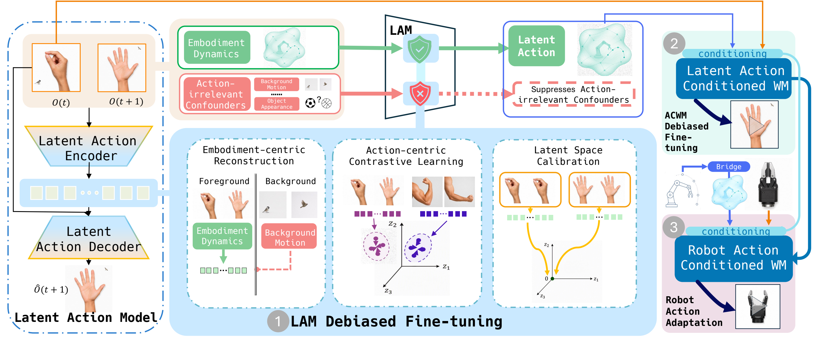

<div align="center">
  <h1>CD-LAM: Causally Debiased Latent Action Model for Embodied Action Conditioned World Models
</h1>
  <p>
    <a href="https://github.com/yufanwei/CD-LAM/actions/workflows/ci.yml"></a>
    
    
    <a href="LICENSE"></a>
  </p>
  <p>
    <a href="https://yufanwei.github.io/CD-LAM-project-page/">Project page</a> ·
    <a href="https://huggingface.co/yufanwei/CD-LAM">Models</a> ·
    <a href="#citation">Citation</a>
  </p>
</div>

<p align="center">
  
</p>

CD-LAM learns causally debiased latent actions for action-conditioned world
models, then aligns robot actions to the same latent space for controllable
video rollout.

## Highlights

- Debiased latent-action learning, world-model pretraining, and robot-action
  post-training in one staged pipeline.
- A single pinned 2B CUDA environment for setup, training, data, and evaluation.
- Three released model entries: LAM, pretrain, and posttrain.
- Reported manuscript FDCE: **8.24** at 2B and **7.73** at 14B. Full tables are
  in [paper_results.json](docs/results/paper_results.json).

## Quick start

Requirements: Linux x86-64, Python 3.10, an Ampere or Hopper GPU, driver
570.124.06 or newer, and about 30 GB of free space. The supported environment
uses PyTorch `2.7.0+cu128` and CUDA 12.8; CUDA execution is required.

```bash
git clone https://github.com/yufanwei/CD-LAM.git
cd CD-LAM
bash setup.sh --accept-base-license
```

Setup creates `.venv`, installs the pinned runtime, validates the GPU, and runs
the test and CUDA smoke suites. Use `--gpu INDEX`, `--with-models`, or
`--with-metrics` when needed. See [GPU setup](docs/MODEL_RUNTIME.md) and
[offline setup](docs/OFFLINE.md).

## Download released models

```bash
bash setup.sh --accept-base-license --with-models
```

| entry | file | role |
|---|---|---|
| LAM | `models/lam/model.pt` | 32D latent-action model |
| pretrain | `models/pretrain/model.pt` | latent-conditioned world model |
| posttrain | `models/posttrain/model.pt` | robot-action post-trained world model |

The LAM and pretrain entries are compatible. The posttrain entry uses the
bridge and action contract in its own folder. See
[Release artifacts](docs/ARTIFACTS.md).

## Download and prepare real datasets

- [AgiBotWorld Alpha](https://huggingface.co/datasets/agibot-world/AgiBotWorld-Alpha)
- [EgoDex](https://github.com/apple/ml-egodex)

```bash
export CDLAM_DATA_ROOT="$PWD/data"
mkdir -p "$CDLAM_DATA_ROOT/raw" "$CDLAM_DATA_ROOT/prepared"

# AgiBotWorld Alpha
.venv/bin/hf auth login
.venv/bin/python scripts/download_datasets.py agibot-sample \
  --output "$CDLAM_DATA_ROOT/raw/agibot-alpha" \
  --accept-license --extract
bash run.sh prepare-agibot \
  --raw-root "$CDLAM_DATA_ROOT/raw/agibot-alpha/sample_dataset" \
  --output-root "$CDLAM_DATA_ROOT/prepared/agibot-alpha" \
  --max-episodes 32

# EgoDex Part 2
.venv/bin/python scripts/download_datasets.py egodex \
  --part part2 --output "$CDLAM_DATA_ROOT/raw/egodex" \
  --accept-license --extract
```

Processing details are in [AgiBot data preparation](docs/RAW_AGIBOT.md),
[EgoDex data preparation](docs/RAW_EGODEX.md), and the shared
[data contract](docs/DATA.md).

## Training commands

```bash
cp configs/runtime.example.json configs/runtime.json
# Fill in the local data and checkpoint paths.
bash run.sh runtime-doctor --stage all

# Complete pipeline
bash run.sh pipeline

# Individual stages
bash run.sh stage1
bash run.sh bridge
bash run.sh stage2
bash run.sh stage3
```

See [Training](docs/TRAINING.md), [Pipeline configuration](docs/PIPELINE.md),
and [Training correctness](docs/TRAINING_CORRECTNESS.md).

## When to use the bridge

| world-model input | bridge |
|---|---:|
| 32D latent action produced by the LAM | no |
| 22D robot action used by Stage 3 or rollout | yes |

The bridge is checkpoint-specific. See
[Checkpoint and bridge contracts](docs/CHECKPOINTS.md).

## Evaluation

```bash
bash run.sh score-fdce \
  --tracks evaluation/tracks/*.npz \
  --output evaluation/fdce.json
```

SAM3 supplies masks and CoWTracker supplies tracks; compatible cached results
can be used instead. See [FDCE scoring](docs/EVALUATION.md) and the
[evaluation protocol](docs/EVAL_PROTOCOL.md).

## Switching model backbones

Compatible 2B checkpoints can be selected together in `configs/runtime.json`
and checked with `bash run.sh runtime-doctor --stage all`. Porting another
architecture requires a matching adapter, LAM, bridge, and preprocessing
contract. The 14B YAML records the paper protocol, but 14B weights and a 14B
runtime adapter are not included.

## Documentation

- [Installation and usage](docs/USAGE.md)
- [Model card](docs/MODEL_CARD.md)
- [Data preparation](docs/DATA.md)
- [Training](docs/TRAINING.md)
- [Evaluation](docs/EVALUATION.md)
- [Third-party dependencies](third_party/README.md)

## Citation

```bibtex
@misc{wei2026cdlam,
  title  = {Causally Debiased Latent Action Model for Embodied Action Conditioned World Models},
  author = {Wei, Yufan and Zhou, Kun and Mao, Lingjun and Zhang, Zijun and Xu, Ziming and Xi, Ziqiao and Liang, Shuang and Han, Ruobing and Yan, Yuchen and Wang, Xinyue and Feng, Fan and Huang, Biwei},
  year   = {2026}
}
```
